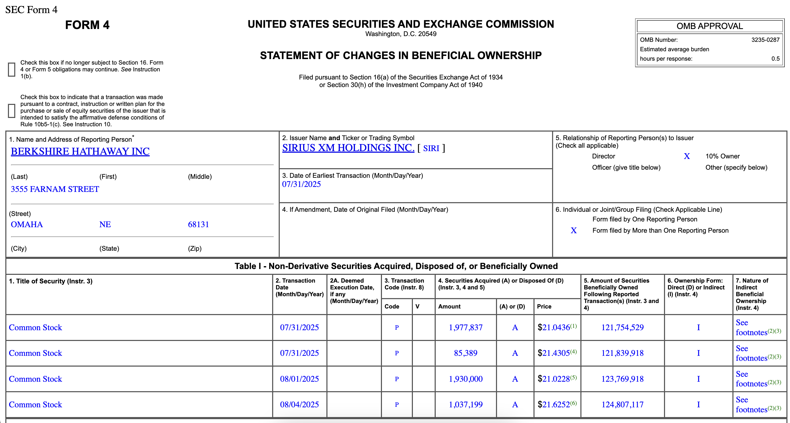
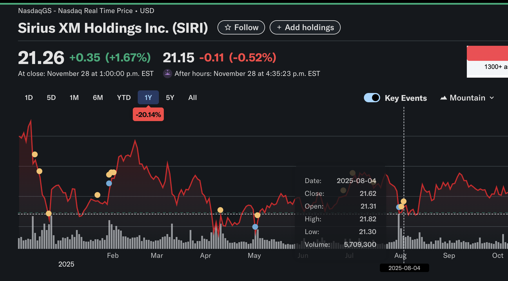
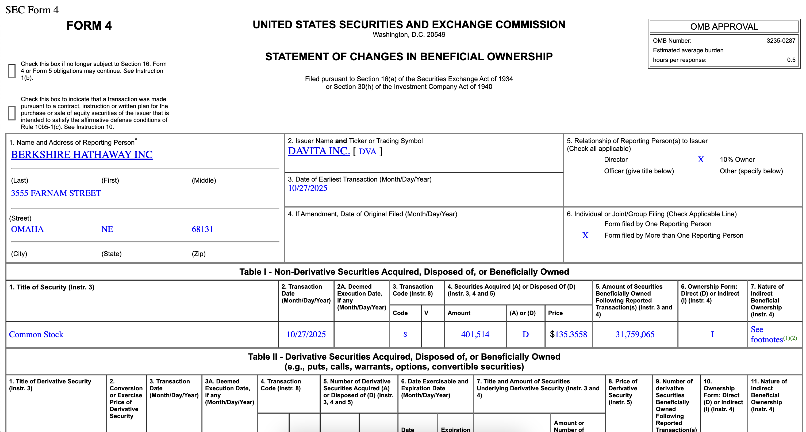
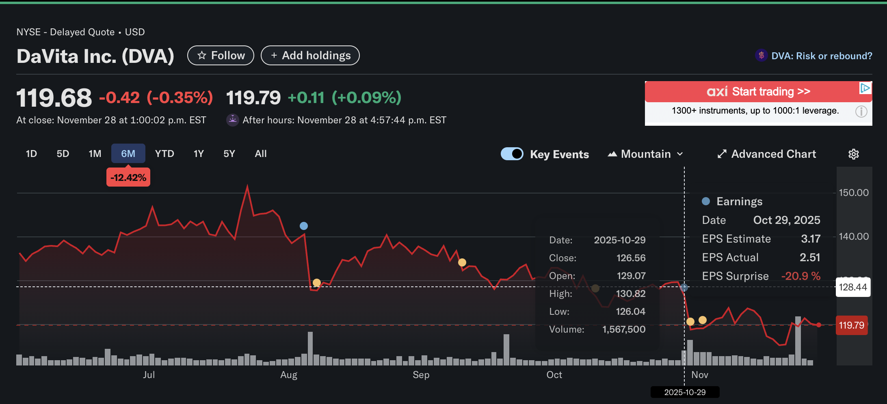

We maintain a watchlist *(starting with the S&P100)* and monitor their SEC filings, specifically 13D, 13G, and form 4.

> ---
> ### Types of Ownership
> ---
> **13D, 13G:** "Beneficial Ownership Reports" are filed within 5 days of a buyer becoming an owner of >5% of a comapnies voting class of stock.
> 
> **Form 4:** Is due within 2 days of a trade from an *insider* of the target (officer/director or >10% owner).

The goal of this project is too explore a tradable signal using this information and then put my hunk of trash old computer to work again.

> ---
> ### Timeline
> ---
> Prototype Stage (R&D)
> 1. Find tradable signal
> 2. Build scanner on a loop
> 3. Develop trade trigger signal
> 4. Develop stock ownership rules (when to sell)
> 
> Production Stage (DevOps)
> 1. Isolate each task into a kafka node
> 2. Connect Interactive brokers
> 3. Create and deploy docker containers for each kafka node
> 4. Deploy on my shit box computer
> 5. Build out front end website component for monitoring
>

This repo will be for the R&D phase of the project because I will need separate repos for the kafka stuff.

> ---
> ### R&D
> ---
> ### **task 1:** Find Evidence *"insider buy --> stock go up"*
> #### SIRUS aquired by Birkshire Hathaway
> Filed 08/04/2025, bought 07/31/2025, stock jumped up a few days later
> 
> 
> #### DAVITA disposed of by Birkshire Hathaway before earnings report
> Filed 10/29/2025, sold 10/27/2025, stock tanked after earnings report
> 
> 
>
> *Note: this was the easiest evidence to find ever. I checked multiple examples from different companies. This trend holds every time.*
---
### Focus on Acquisitions
#### "There are many reasons to sell something and only one reason to buy something."

> ---
> ### R&D
> ---
> ### **task 2:** design web scraping tool to pull and interpret data
> 
> input / config
> - dictionary of company codes for searching
> - uuid: unique to this project for a company
> - name: common name known to SEC and IBKR
> - description: notable detail on the company
> - ibkr: Interactive Brokers id, may need to change this for the algorithm part
> - cik: unique SEC id
> 
> processing
> - webscrapper and form interpreter
> 
> output kafka-topics
> - producer: **trade_actions**
> - producer: **pulse**

Rule:
If the earnings call is within a few days wait for price to settle.
